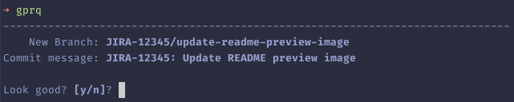
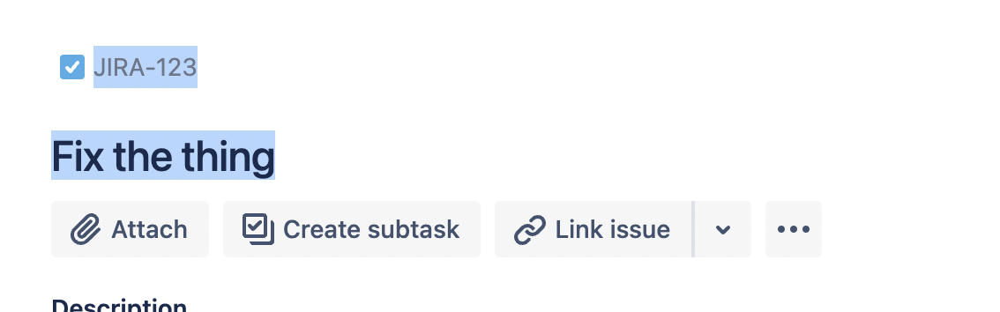

# gprq

`gprq` — "Git Pull Request Quick".

Git `add`, `branch`, `commit`, `push`, create PR, open browser — in a single command!


Wowwwww what is this [magic](#marker-jira-ticket)???



`gprq` is great for doing lots of atomic PRs/commits (small PRs with a single
purpose, so they are easy for people to code review).

---

# Installation

Requires `python3` to be installed. `gprq` will try to find `python3` and if
that doesn't exist, fall back to `python`. `python2` might work, I haven't
tried.

## Bash

```
installation_dir=~ # Feel free to customise this
cd $installation_dir
git clone git@github.com:dylan-chong/gprq.git

printf "\n# Load the gprq function\nsource $installation_dir/gprq/gprq.bash\n\n" >> ~/.bashrc
source .bashrc
```

## ZSH

### ZPlug / Antigen / Other Plugin manager

Similar for other plugin managers

```zsh
zplug dylan-chong/gprq, from:github
antigen bundle dylan-chong/gprq
...
```

### Oh My Zsh

1. In your `.zshrc`
```zsh
plugins=(
    ...
    gprq
)
```
1. `git clone https://github.com/dylan-chong/gprq ${ZSH_CUSTOM:-~/.oh-my-zsh/custom}/plugins/gprq`
1. Start a new zsh session

### No plugin manager

Use the method in the Bash section, but `s/bash/zsh` in the instructions

# Compatibility

Currently only fully supports MacOS (pasting from clipboard will work on Mac
and Linux with X11 (need testers)).
Excluding this, it should :tm: work on any Unix OS (including WSL).

Opening in the browser uses the python3 [`webbrowser`
module](https://docs.python.org/3/library/webbrowser.html).

Works with GitHub and Bitbucket.

PRs welcome!

---

# Usage

Do coding stuff.
Then do one of the following; *(Just finished a JIRA ticket? See option 2)*:

## 1. Pass a commit message - `gprq <commit_message>`

- commit_message can be something like:
    - `Fix the thing`
    - `Fix: The thing`
    - `JIRA-123: Fix the thing`
    - `JIRA-123: Fix the thing - Part 1`
- The branch name will be a reformatted commit message

## <span id="marker-jira-ticket">2. Use JIRA ticket number and title - My favourite option!</span>

- Drag-select the `JIRA-123 Fix the thing from the
website` from your JIRA ticket 
    - Tip: It's easiest if drag-select from the right of the title up/left
- Copy it to your clipboard
- Run `gprq`. You will see:
    ```
        New Branch: JIRA-123/fix-the-thing-from-the-website
    Commit message: JIRA-123: Fix the thing from the website
    ```
- Profit! (yea, lol, it works :shrug:)

## 3. Pass a branch name - `gprq <branch_name>`

- branch_name can be something like:
    - `fix-the-thing`
    - `fix/the-thing`
    - `JIRA-123/fix-the-thing`
    - `JIRA-123/fix-the-thing--part-1--stuff`
- The commit message will be a reformatted branch name

---

# Tips

1. If you're using MacOS and you use multiple browsers, I highly recommend
   using [Browserosaurus](https://browserosaurus.com/) to select the browser
1. Never checkout the main/master branch. Always `git fetch && git checkout origin/HEAD`.
   That way you can never need to worry about pulling from the main branch.
   Even better, I like to alias this to `gcoh` "Git checkout (origin) head"
